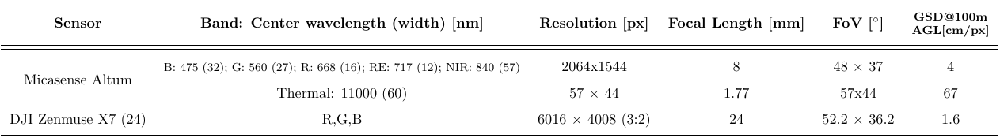
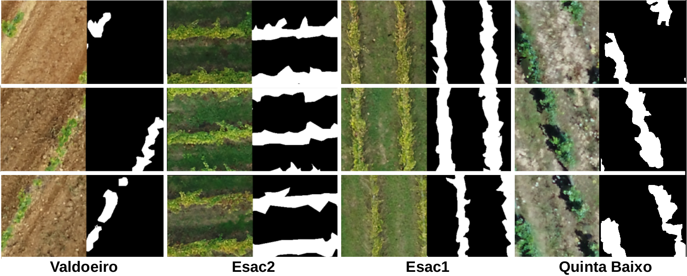

# DATASET: GREEN AI

Download dataset from [HERE](https://isrucpt-my.sharepoint.com/:f:/g/personal/tiagobarros_isr_uc_pt/EgHCeLjA1kRDmFkCckpon-IBVGbXXo1FtBVYDhhfRetaJQ?e=mE1XZk)

The dataset contains data from three vineyards of central Portugal: Esac (at Coimbra), Valdoeiro and Quinta de Baixo. The data was acquired with a UAS that had a multispectral sensor and a high-definition camera onboard. The acquired images were used to build orthomosaics and digital surface models (DSM) from the respective plots. 

The dataset comprises:
- **Mulstispectral** (MS) orthomosaics (R,G,B,RE,NIR, and Thermal)
- **High-definition** (HD) orthomosaics (R,G,D)
- **Digital Surface Models** (DSM)

 


Figure 1: Outline of the three vineyards:

|           | RGB-HS     | DSM     |    RGB-MS| False-Color RE-R-G   |     
|:----------|:----------:|:-------:|:--------:|:---------------------:|     
| ESAC      | b          | c       | d        | e                    |        
| Valdoeiro | f          | g       | h        |    i                 |  
| Quinta de Baixo|    j  | l       | m        | n                    |


## Sensors


## Ground Truth
For the three vineyards,  ground truth masks (pixel-level labels) were generated. The masks include only one class, which identifies vines. However, only the Esac vineyard was completely labeled; the other two orthomosaics were only partially labeled.  



```
Link : 
Orthomosaics
│
├── esac
│   │
│   ├──altum 
│   │   ├── ortho.tif
│   │   └── mask.tif
│   │
│   ├── x7
│   │    ├── ortho.tif
│   │    └── mask.tif
│   │
│   └── dsm.tif
│
│
├── valdoeiro
│   │
│   ├──altum 
│   │   ├── ortho.tif
│   │   └── mask.tif
│   ├── x7
│   │   ├── ortho.tif
│   │   └── (not available)
│   │
│   └── dsm.tif
│
│
└── qtabaixo
    │
    ├──altum 
    │   ├── ortho.tif
    │   └── mask.tif
    │
    ├── x7
    │   ├── ortho.tif
    │   └── (not available)
    │
    └── dsm.tif
```


# Computation setup:
Laptop: CUDA Version: 11.3 \
python 3.7 


# Orthoseg pipeline 
To run the pipeline proposed in [paper](https://arxiv.org/abs/2108.01200). 

run: 

    orthosegmentation.py 


# Pretrained models: Model and Dataset Dependent

The pretrained models with a specific dataset maintain the copyright of such dataset.

Link to preprinted models will be published soon 


# Citations

If you use our framework, model, or predictions for any academic work, please cite the original [paper](https://arxiv.org/abs/2108.01200).

```
@article{barros2021attdlnet,  
    title={AttDLNet: Attention-based DL network for 3D LiDAR place recognition},  
    author={Barros, Tiago and Garrote, Lu{\'\i}s and Pereira, Ricardo and Premebida, Cristiano and Nunes, Urbano J},  
    journal={arXiv preprint arXiv:2106.09637},  
    year={2021}  
}
``` 


## License

### Multispectral Vineyard Segmentation: A Deep Learning approach: MIT

Copyright (c) 2021 Tiago Barros, Pedro Conde, Gil Gonçalves, Cristiano Premebida, Miguel Monteiro, Carla S.S. Ferreira, Urbano J. Nunes.

Permission is hereby granted, free of charge, to any person obtaining a copy of this software and associated documentation files (the "Software"), to deal in the Software without restriction, including without limitation the rights to use, copy, modify, merge, publish, distribute, sublicense, and/or sell copies of the Software, and to permit persons to whom the Software is furnished to do so, subject to the following conditions:

The above copyright notice and this permission notice shall be included in all copies or substantial portions of the Software.

THE SOFTWARE IS PROVIDED "AS IS", WITHOUT WARRANTY OF ANY KIND, EXPRESS OR IMPLIED, INCLUDING BUT NOT LIMITED TO THE WARRANTIES OF MERCHANTABILITY, FITNESS FOR A PARTICULAR PURPOSE AND NONINFRINGEMENT. IN NO EVENT SHALL THE AUTHORS OR COPYRIGHT HOLDERS BE LIABLE FOR ANY CLAIM, DAMAGES OR OTHER LIABILITY, WHETHER IN AN ACTION OF CONTRACT, TORT OR OTHERWISE, ARISING FROM, OUT OF OR IN CONNECTION WITH THE SOFTWARE OR THE USE OR OTHER DEALINGS IN THE SOFTWARE.
