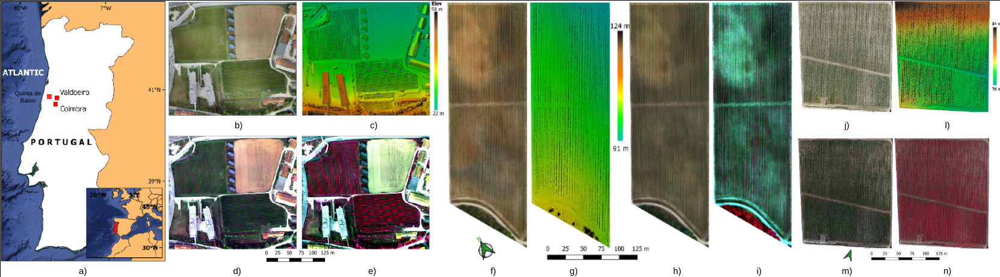

# DATASET: GREEN AI

Link: https://drive.google.com/drive/folders/1iyrKndWzG9lOM-aVLs2gt3kgJUt0ychE?usp=sharing

The dataset contains data from four vineyards of central Portugal: Esac (at Coimbra), Valdoeiro and Quinta de Baixo. The data was acquired with a UAS that had a multispectral sensor and a high-definition camera onboard. The acquired images were used to build orthomosaics and digital surface models (DSM) from the respective plots. 

 

Figure 1:  
- ESAC: b, c, d and e;  
- Valdoeiro: f, g, h, and i;  
- Quinta de Baixo: j, l, m, and n.  

The dataset comprises:
- Mulstispectral(R,G,B,RE,NIR, and Thermal) orthomosaics
- High-definition orthomosaics 
- Digital Surface Models


```
Paper data
├── ESAC1
│   ├── altum
│   │   ├── images
│   │   │   ├── 00000.tiff
│   │   │   ├── 00001.tiff
│   │   │   ...
│   │   │
│   │   └── masks
│   │       ├── 00000.tiff
│   │       ├── 00001.tiff
│   │        ...
│   │
│   └── x7
│       ├── images
│       │   ├── 00000.tiff
│       │   ├── 00001.tiff
│       │    ...
│       │
│       └── masks
│           ├── 00000.tiff
│           ├── 00001.tiff
│            ...
│    
│
├── ESAC2
│   ├── altum
│   │   ├── images
│   │   │   ├── 00000.tiff
│   │   │   ├── 00001.tiff
│   │   │   ...
│   │   │
│   │   └── masks
│   │       ├── 00000.tiff
│   │       ├── 00001.tiff
│   │        ...
│   │
│   └── x7
│       ├── images
│       │   ├── 00000.tiff
│       │   ├── 00001.tiff
│       │     ...
│       │
│       └── masks
│           ├── 00000.tiff
│           ├── 00001.tiff
│
│
│
├── Valdoeiro
│   ├── altum
│   │   ├── images
│   │   │   ├── 200000.npy 
│   │   │   ├── 200001.npy 
│   │   │   ...
│   │   │
│   │   └── masks
│   │       ├── 200000.npy 
│   │       ├── 200001.npy 
│   │        ...
│   └── x7
│       ├── images
│       │   ├── 200000.npy 
│       │   ├── 200001.npy 
│       │    ...
│       │
│       └── masks
│           ├── 200000.npy 
│           ├── 200001.npy 
│            ...
│            
│
└── QtaBaixo
    ├── altum
    │   ├── images
    │   │   ├── 00000.tiff
    │   │   ├── 00001.tiff
    │   │   ...
    │   │
    │   └── masks
    │       ├── 00000.tiff
    │       ├── 00001.tiff
    │        ...
    └── x7
        ├── images
        │   ├── 00000.tiff
        │   ├── 00001.tiff
        │    ...
        │
        └── masks
            ├── 00000.tiff
            ├── 00001.tiff
            ...
            
```


# Computation setup:
Laptop: CUDA Version: 11.3 \
python 3.7 


# Orthoseg pipeline 

To run the pipeline proposed at [paper](https://arxiv.org/abs/2108.01200). 

run: 

    $ orthosegmentation.py 


# Pretrained models: Model and Dataset Dependent

The pretrained models with a specific dataset maintain the copyright of such dataset.

Link to preprinted models will be published soon 


## Citations

If you use our framework, model, or predictions for any academic work, please cite the original [paper](https://arxiv.org/abs/2108.01200), and the [dataset](https://drive.google.com/drive/folders/1PeDqlXa-TISJcPGB2kaJ547LV5M3E_xU?usp=sharing).


## License

### Multispectral Vineyard Segmentation: A Deep Learning approach: MIT

Copyright (c) 2021 Tiago Barros, Pedro Conde, Gil Gonçalves, Cristiano Premebida, Miguel Monteiro, Carla S.S. Ferreira, Urbano J. Nunes.

Permission is hereby granted, free of charge, to any person obtaining a copy of this software and associated documentation files (the "Software"), to deal in the Software without restriction, including without limitation the rights to use, copy, modify, merge, publish, distribute, sublicense, and/or sell copies of the Software, and to permit persons to whom the Software is furnished to do so, subject to the following conditions:

The above copyright notice and this permission notice shall be included in all copies or substantial portions of the Software.

THE SOFTWARE IS PROVIDED "AS IS", WITHOUT WARRANTY OF ANY KIND, EXPRESS OR IMPLIED, INCLUDING BUT NOT LIMITED TO THE WARRANTIES OF MERCHANTABILITY, FITNESS FOR A PARTICULAR PURPOSE AND NONINFRINGEMENT. IN NO EVENT SHALL THE AUTHORS OR COPYRIGHT HOLDERS BE LIABLE FOR ANY CLAIM, DAMAGES OR OTHER LIABILITY, WHETHER IN AN ACTION OF CONTRACT, TORT OR OTHERWISE, ARISING FROM, OUT OF OR IN CONNECTION WITH THE SOFTWARE OR THE USE OR OTHER DEALINGS IN THE SOFTWARE.
